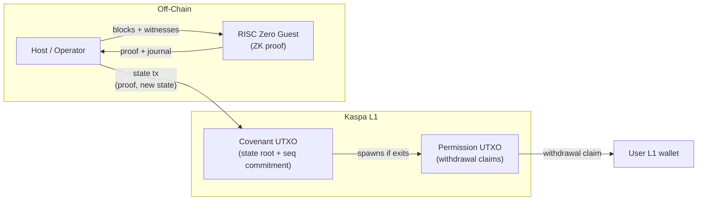

# Introduction

This book documents the **ZK Covenant Rollup**, a proof-of-concept Layer 2 rollup bridge built on Kaspa using covenants and zero-knowledge proofs.

## What is this?

The ZK Covenant Rollup demonstrates how off-chain state transitions can be proven with [RISC Zero](https://www.risczero.com/) and verified on-chain through Kaspa's covenant mechanism. Users deposit funds into a covenant-controlled UTXO, perform off-chain transfers on an account-based L2, and withdraw back to L1 — all enforced cryptographically without trusting the rollup operator.

The system has three core properties:

1. **Validity** — Every state transition is backed by a ZK proof. The on-chain script rejects any update that fails verification.
2. **Liveness** — Withdrawals are processed through a permission tree. Once the guest proof commits an exit, the on-chain permission script allows anyone to claim it.
3. **Soundness** — The guest proof pipeline verifies every action's authorization, balance sufficiency, and SMT consistency. A malicious host cannot forge state updates.

## High-level flow

**Deposit (Entry):** A user sends funds to the delegate script address. The next proof batch picks up the deposit transaction, verifies the output pays the correct covenant-bound P2SH, and credits the L2 account.

**Transfer:** An L2 user signs a transfer payload. The guest verifies the signature via previous-transaction output introspection and updates the SMT.

**Withdrawal (Exit):** An L2 user creates an exit action. The guest debits their account and adds a leaf to the permission tree. The on-chain permission script lets anyone claim the withdrawal by presenting a Merkle proof.

## Scope

This book covers the **PoC logic only**: the core library, guest proof program, and on-chain script construction. The host binary (demo runner) is not documented — it will become a library crate.

## Reading guide

| You want to...                  | Start at                                      |
|---------------------------------|-----------------------------------------------|
| Understand the architecture     | [Chapter 2: Architecture](ch02-architecture.md) |
| Learn the data model            | [Chapter 3: Account Model](ch03-account-model.md) |
| See how proofs work             | [Chapter 5: Guest Proof Pipeline](ch05-guest-proof-pipeline.md) |
| Understand on-chain scripts     | [Chapter 7: State Verification](ch07-state-verification.md) |
| Audit security properties       | [Chapter 11: Security Model](ch11-security-model.md) |
| Look up a domain separator      | [Appendix A](appendix-a-domain-separators.md) |
