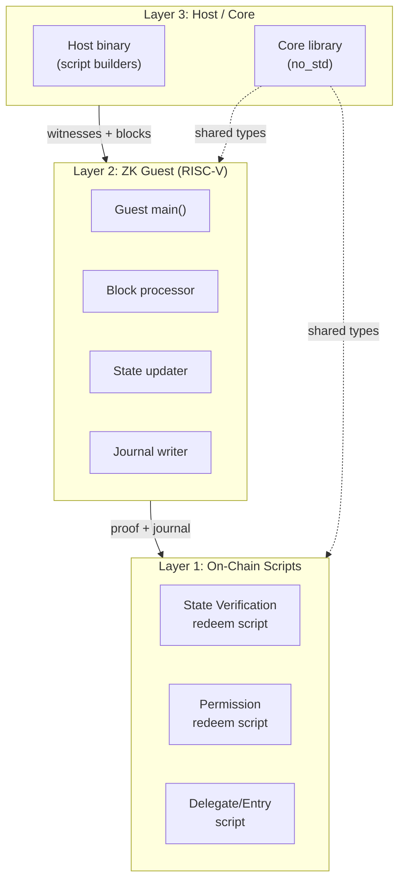
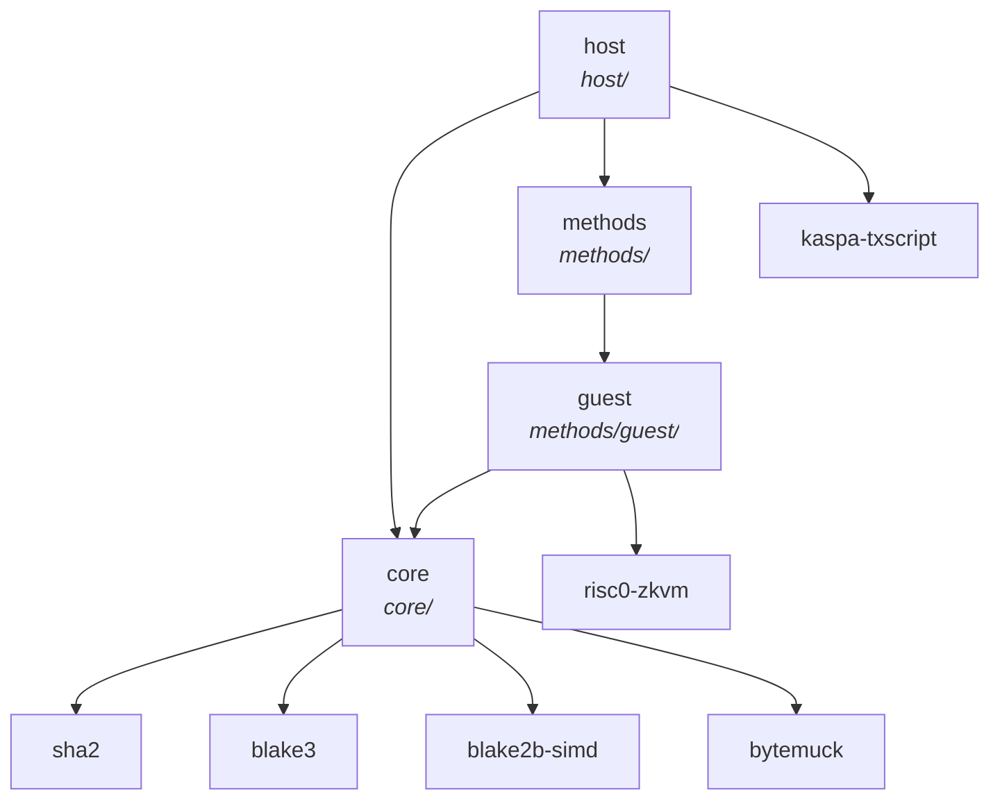

# Architecture

The ZK Covenant Rollup is organized into three layers, each running in a different environment. All cryptographic invariants are enforced at layer boundaries.

## Three-layer design



## Crate map

The project consists of four crates:

| Crate | Path | Target | Role |
|-------|------|--------|------|
| `zk-covenant-rollup-core` | `core/` | `no_std` (RISC-V + native) | Shared types, hash functions, script construction |
| `zk-covenant-rollup-guest` | `methods/guest/` | RISC-V (`riscv32im-risc0-zkvm-elf`) | ZK proof program |
| `zk-covenant-rollup-methods` | `methods/` | native | Build harness for guest ELF |
| `zk-covenant-rollup-host` | `host/` | native | Demo runner, script builders, tests |



### Core (`no_std`)

The core crate runs in **both** the RISC-V guest and on native. It is `no_std` with `alloc` support. Key responsibilities:

- **Data types** — `PublicInput`, `Account`, `AccountWitness`, `ActionHeader`, action payloads
- **SMT** — 8-level Sparse Merkle Tree with SHA-256 domain-separated hashing
- **Sequence commitment** — Blake3-based streaming Merkle tree for block chaining
- **Permission tree** — SHA-256 Merkle tree of withdrawal claims
- **Permission script** — Byte-level redeem script construction (`no_std` compatible)
- **P2SH / P2PK** — Script public key helpers
- **Transaction ID** — V0 (blake2b) and V1 (blake3 payload + rest) computation

```rust
{{#include ../../core/src/lib.rs:public_input}}
```

### Guest (RISC-V)

The guest runs inside the RISC Zero zkVM. It reads `PublicInput` and witness data from stdin, processes all blocks, and writes a journal that the on-chain script verifies.

```rust
{{#include ../../methods/guest/src/main.rs:guest_main}}
```

The guest is **deterministic**: given the same inputs, it always produces the same journal. The host cannot influence the output except by providing different (but valid) witness data.

### Host

The host crate builds transactions and runs the demo. It uses `kaspa-txscript`'s `ScriptBuilder` for the state verification and permission redeem scripts. The host is **not trusted** — everything it produces is verified either by the guest (inside the ZK proof) or by the on-chain script.

## What runs where

| Component | Environment | Trusted? | Verified by |
|-----------|-------------|----------|-------------|
| Core types & hashes | Everywhere | N/A (library) | — |
| Guest proof program | RISC Zero zkVM | Yes (proven) | ZK verifier on-chain |
| State verification script | Kaspa node | Yes (consensus) | All full nodes |
| Permission script | Kaspa node | Yes (consensus) | All full nodes |
| Delegate script | Kaspa node | Yes (consensus) | All full nodes |
| Host / operator | Off-chain | **No** | Guest + on-chain scripts |

The host can:
- Choose the range of L1 blocks to process (committed to seq commitment, verified against L1)
- Filter which transactions within those blocks are L2 actions
- Provide witness data (SMT proofs, prev tx preimages)

Action order is inherited from L1 transaction order — the host cannot reorder or skip actions.

The host **cannot**:
- Forge a valid ZK proof for an invalid state transition
- Steal funds (covenant enforcement)
- Credit accounts without real deposits (SPK verification)
- Process withdrawals without proper authorization (prev tx proof)
