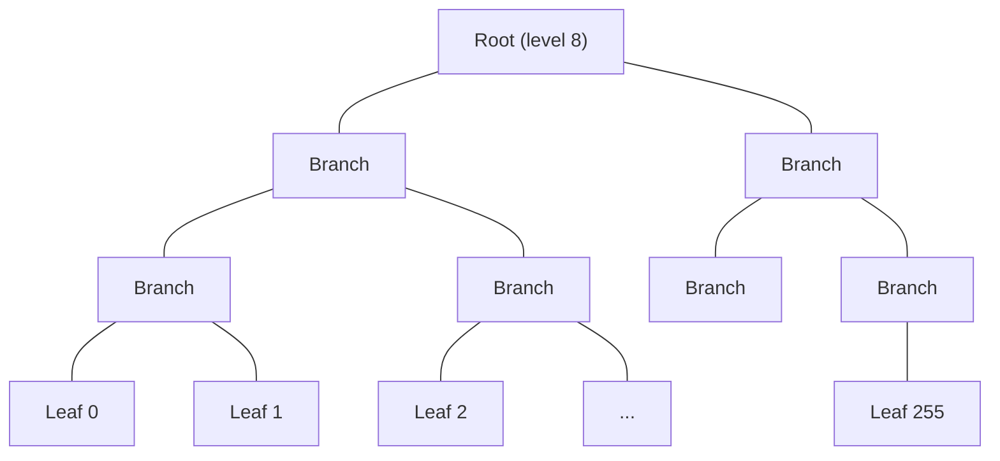

# Account Model

The rollup uses an account-based state model backed by a Sparse Merkle Tree (SMT). Each account maps a 32-byte public key to a balance, and the entire state is summarized by a single 32-byte root hash.

## Sparse Merkle Tree

The SMT has **8 levels** supporting up to **256 accounts** — sufficient for the PoC. The tree uses SHA-256 with domain-separated hashing at every level to prevent second-preimage attacks across domains.



### Hash functions

All SMT hashes use SHA-256 with distinct domain prefixes:

```rust
{{#include ../../core/src/smt.rs:leaf_hash}}
```

```rust
{{#include ../../core/src/smt.rs:branch_hash}}
```

```rust
{{#include ../../core/src/smt.rs:empty_leaf_hash}}
```

### Key mapping

Account position in the tree is determined by the first byte of the public key:

```rust
{{#include ../../core/src/smt.rs:key_to_index}}
```

This means two accounts whose pubkeys share the same first byte would collide. For a 256-slot PoC this is acceptable; a production system would use a deeper tree with a proper hash-based index.

### SMT proof

A proof consists of 8 sibling hashes — one per tree level. Verification walks from leaf to root, choosing left/right based on the key bits:

```rust
{{#include ../../core/src/smt.rs:smt_proof}}
```

## Account and AccountWitness

An `Account` is a `(pubkey, balance)` pair (40 bytes). An `AccountWitness` adds the SMT proof so the guest can verify membership and compute updated roots:

```rust
{{#include ../../core/src/state.rs:account}}
```

```rust
{{#include ../../core/src/state.rs:account_witness}}
```

## Empty tree root

The empty tree root is computed deterministically by hashing empty leaves upward through all 8 levels:

```rust
{{#include ../../core/src/state.rs:empty_tree_root}}
```

## State root type

The state root is simply `[u32; 8]` — a 32-byte SHA-256 hash stored as 8 words for zkVM alignment efficiency. See `core/src/state.rs:93` for the type alias.

## Design rationale

**Why SHA-256?** The RISC Zero zkVM has accelerated SHA-256 support, making it the cheapest hash function inside the guest. All account-state hashing uses SHA-256 for this reason.

**Why `[u32; 8]` instead of `[u8; 32]`?** The zkVM operates on 32-bit words. Using `[u32; 8]` avoids alignment issues and unnecessary byte shuffling. The `bytemuck` crate provides zero-copy conversion when byte-level access is needed.

**Why 8 levels?** The PoC targets a small number of accounts for demonstration. The depth is a constant (`SMT_DEPTH`) and could be increased for production use.
