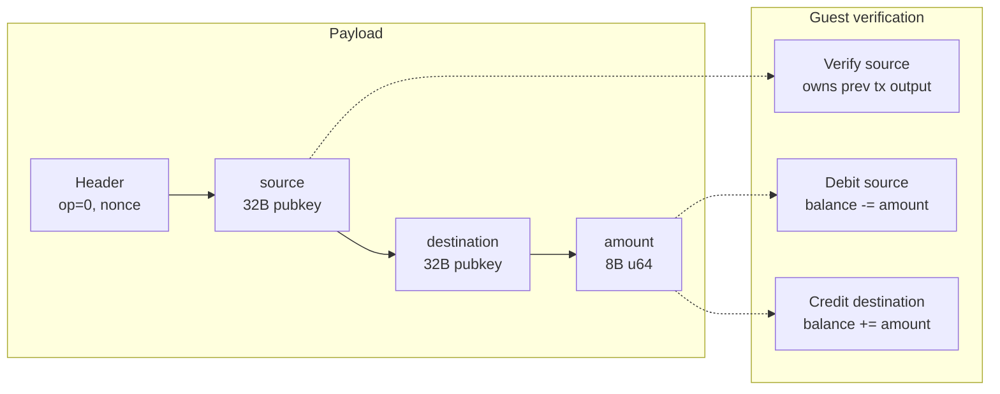
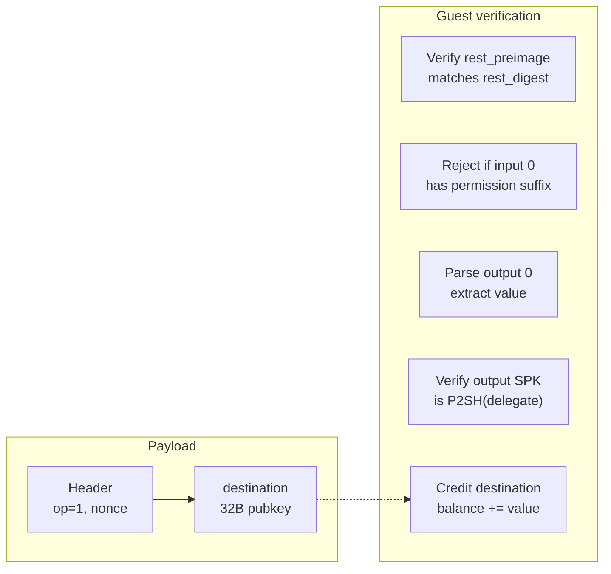
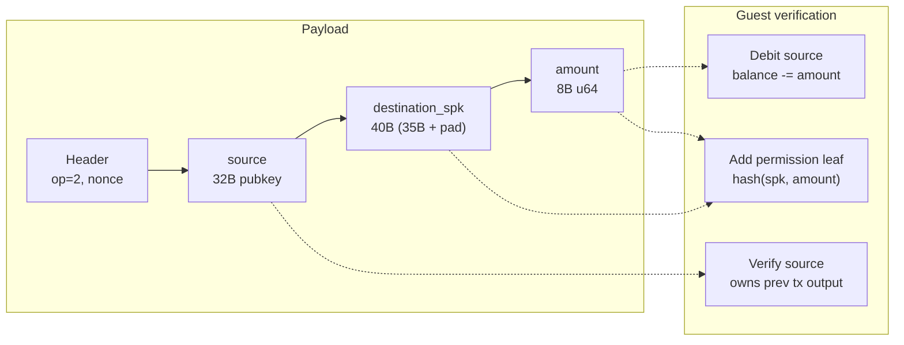

# Action Types

Actions are the state-transition primitives of the rollup. Each action is encoded in a Kaspa transaction payload and identified by its operation code.

## Action identification

A transaction is recognized as an action when its `tx_id` starts with the magic prefix byte `0x41` (`'A'`):

```rust
{{#include ../../core/src/lib.rs:is_action_tx_id}}
```

The host mines a `nonce` in the `ActionHeader` until the resulting `tx_id` starts with this prefix. Using a single byte means roughly 1 in 256 nonces will match — fast enough for testing.

## Action header

Every action payload starts with an 8-byte header:

```rust
{{#include ../../core/src/action.rs:action_header}}
```

The `operation` field determines what data follows and how much to read.

## Three operation codes

| Opcode | Name | Value | Payload size | Description |
|--------|------|-------|-------------|-------------|
| `OP_TRANSFER` | Transfer | 0 | 80 bytes (header + 72) | L2-to-L2 balance transfer |
| `OP_ENTRY` | Entry | 1 | 40 bytes (header + 32) | L1-to-L2 deposit |
| `OP_EXIT` | Exit | 2 | 88 bytes (header + 80) | L2-to-L1 withdrawal |

## Transfer (opcode 0)

Moves funds between two L2 accounts.

```rust
{{#include ../../core/src/action.rs:transfer_action}}
```



**Authorization:** The guest verifies the source pubkey by checking a previous transaction output. The host provides a `PrevTxV1Witness` containing the `rest_preimage` and `payload_digest`. The guest recomputes the `tx_id`, extracts the output SPK, and confirms it is a Schnorr P2PK matching `source`.

**State update:** The guest verifies the source's SMT proof against the current root, debits the balance, computes an intermediate root, then verifies the destination's proof against that intermediate root and credits the balance.

## Entry / Deposit (opcode 1)

Credits an L2 account from an L1 deposit.

```rust
{{#include ../../core/src/action.rs:entry_action}}
```



**Key design:** The deposit amount is **not** in the payload. It comes from the transaction's first output value, verified via the `rest_preimage`. This prevents the host from inflating deposit amounts — the value is cryptographically committed via `rest_digest` → `tx_id`.

**SPK verification:** The guest verifies that output 0's SPK is `P2SH(delegate_script(covenant_id))`. This ensures the deposited funds are actually locked in the covenant, not sent to an arbitrary address.

**Permission suffix guard:** The guest rejects entry actions whose transaction's first input has the permission domain suffix (`[0x51, 0x75]`). This prevents delegate change outputs (from withdrawal transactions) from being misinterpreted as new deposits.

## Exit / Withdrawal (opcode 2)

Debits an L2 account and creates a withdrawal claim on L1.

```rust
{{#include ../../core/src/action.rs:exit_action}}
```



**SPK encoding:** The `destination_spk` field holds up to 35 bytes of L1 script public key, padded to 40 bytes (10 words) for alignment. The actual length is inferred from the first byte: `0x20` (OP_DATA_32) means 34-byte Schnorr P2PK; anything else means 35 bytes (ECDSA P2PK or P2SH).

**Permission leaf:** On successful debit, the guest adds `perm_leaf_hash(spk, amount)` to the streaming permission tree builder. After all blocks are processed, this tree's root is committed to the journal, enabling on-chain withdrawal claims.

## The Action enum

All three types are unified under a single enum for dispatch:

```rust
{{#include ../../core/src/action.rs:action_enum}}
```

The `source()` method returns `None` for entry actions (deposits come from L1, not an L2 account). This distinction drives the authorization logic in the guest — entries skip source verification entirely.
