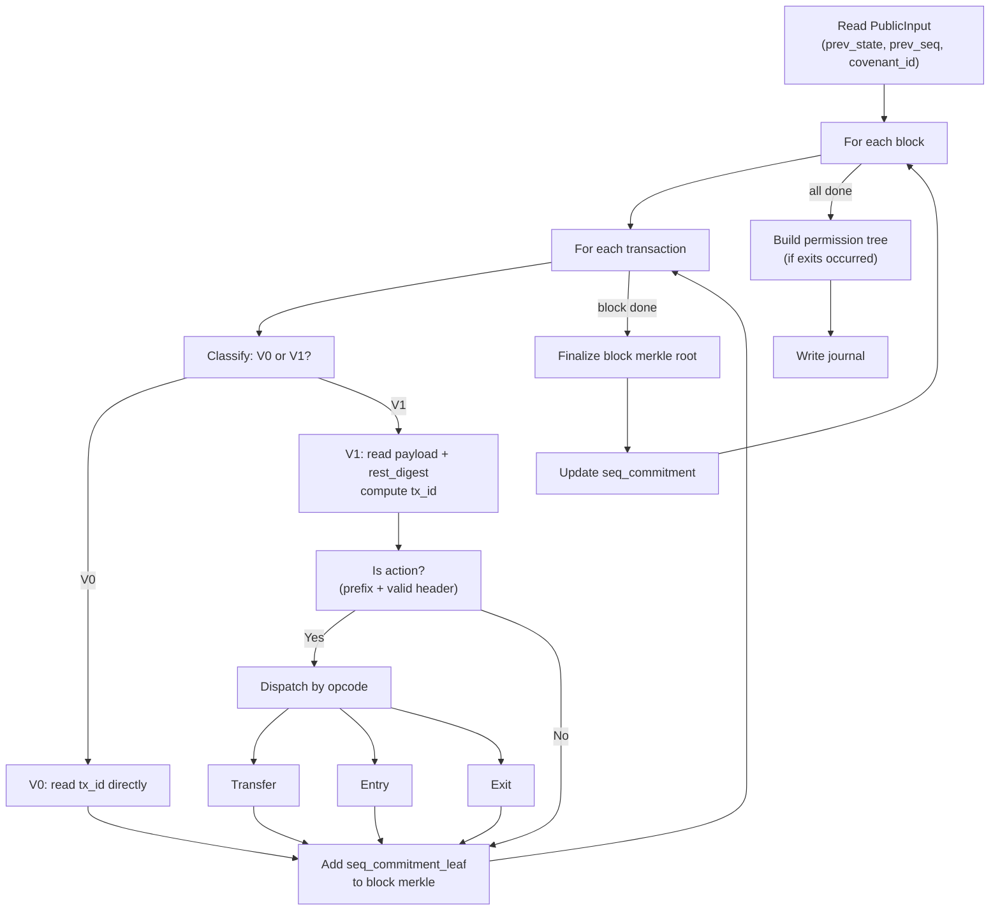
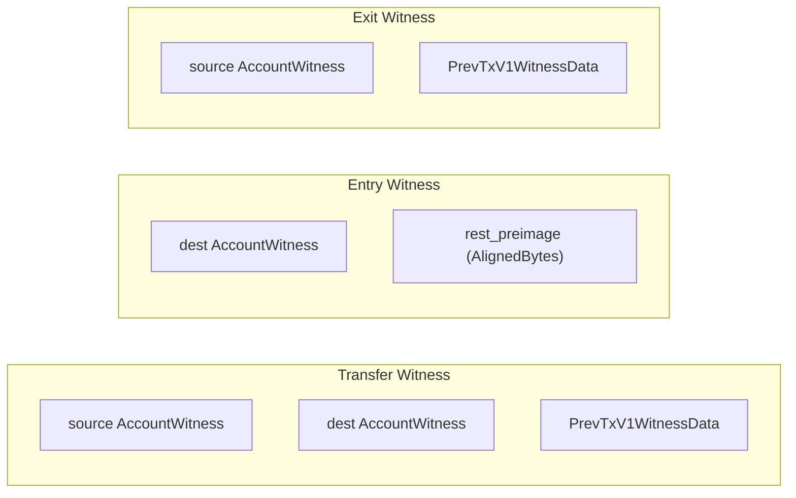

# Guest Proof Pipeline

The guest program is the heart of the rollup. It runs inside the RISC Zero zkVM, reads blocks and witness data from the host, processes every transaction, updates the state root, and writes a journal that the on-chain script can verify.

## Overview



## PublicInput

The guest begins by reading `PublicInput` — three 32-byte hashes that anchor the proof to the chain:

- `prev_state_hash` — the SMT root before this batch
- `prev_seq_commitment` — the sequence commitment before this batch
- `covenant_id` — identifies this specific covenant instance

These values are written to the journal so the on-chain script can verify they match the previous UTXO.

## Block processing

```rust
{{#include ../../methods/guest/src/block.rs:process_block}}
```

Each block contains a list of transactions. The guest processes them sequentially, building a streaming Merkle tree of `seq_commitment_leaf(tx_id, version)` values. The finalized block root is then combined with the running `seq_commitment` via `calc_accepted_id_merkle_root`.

## Transaction classification

```rust
{{#include ../../methods/guest/src/tx.rs:read_v1_tx_data}}
```

For V1 transactions, the guest:

1. Reads the payload bytes and `rest_digest` from stdin
2. Computes `payload_digest` from the raw payload bytes
3. Computes `tx_id = blake3(payload_digest || rest_digest)`
4. Checks if the `tx_id` starts with `ACTION_TX_ID_PREFIX` (`0x41`)
5. If so, parses the payload as an action header + data

The action is only considered valid if the prefix matches **and** the header version and operation are recognized **and** the action-specific validity check passes (e.g., non-zero amount).

## Action parsing

```rust
{{#include ../../methods/guest/src/tx.rs:parse_action}}
```

## Action dispatch

```rust
{{#include ../../methods/guest/src/block.rs:process_action}}
```

## Witness structures

Each action type requires different witness data from the host:

```rust
{{#include ../../methods/guest/src/witness.rs:transfer_witness}}
```

```rust
{{#include ../../methods/guest/src/witness.rs:entry_witness}}
```

```rust
{{#include ../../methods/guest/src/witness.rs:exit_witness}}
```



## Source authorization

For transfers and exits, the guest verifies that the action's `source` pubkey matches the public key in a previous transaction output:

```rust
{{#include ../../methods/guest/src/auth.rs:verify_source}}
```

The verification chain is:
1. Host provides `prev_tx_id` + `PrevTxV1Witness` (rest_preimage, payload_digest)
2. Guest recomputes `tx_id` from the witness and checks it matches `prev_tx_id`
3. Guest parses the output at the specified index from `rest_preimage`
4. Guest checks the output SPK is Schnorr P2PK format (34 bytes)
5. Guest extracts the 32-byte pubkey and compares with `action.source`

Only Schnorr P2PK sources are accepted — ECDSA and P2SH sources are rejected.

## State updates

```rust
{{#include ../../methods/guest/src/state.rs:process_exit_state}}
```

```rust
{{#include ../../methods/guest/src/state.rs:verify_and_update_dest}}
```

For transfers, the state update is two-phase:
1. **Debit source** — verify SMT proof, check balance, compute intermediate root
2. **Credit destination** — verify SMT proof against intermediate root, compute final root

For entries, only the credit phase runs (no source debit).

For exits, only the debit phase runs, and a permission leaf is added.

## Journal output

```rust
{{#include ../../methods/guest/src/journal.rs:write_output}}
```

The journal is the proof's public output — the only data the on-chain script can see. Its layout:

| Offset | Size | Field |
|--------|------|-------|
| 0 | 32B | `prev_state_hash` |
| 32 | 32B | `prev_seq_commitment` |
| 64 | 32B | `new_state_root` |
| 96 | 32B | `new_seq_commitment` |
| 128 | 32B | `covenant_id` |
| 160 | 32B | `permission_spk_hash` (optional) |

**Base journal:** 160 bytes (40 words) — always present.

**Extended journal:** 192 bytes (48 words) — when exits occurred. The extra 32 bytes contain the blake2b hash of the permission redeem script's P2SH SPK.

## Permission tree construction

When exit actions occur, the guest builds a permission tree:

1. Each successful exit adds `perm_leaf_hash(spk, amount)` to a `StreamingPermTreeBuilder`
2. After all blocks, if any exits occurred:
   - The host provides the expected redeem script length
   - Guest computes the tree root with `pad_to_depth`
   - Guest builds the permission redeem script bytes (using the `no_std` builder in core)
   - Guest asserts the built script length matches the host-provided value
   - Guest computes `blake2b(redeem_script)` → the permission SPK hash
3. This hash is appended to the journal

The on-chain state verification script uses the journal's permission SPK hash to verify that the second covenant output (if present) pays to the correct permission script.
