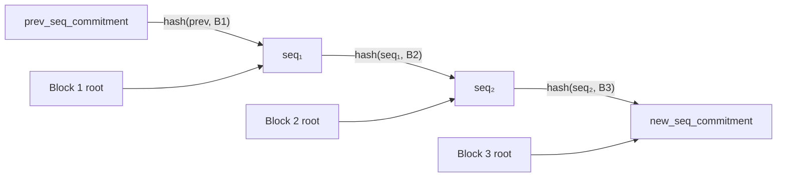
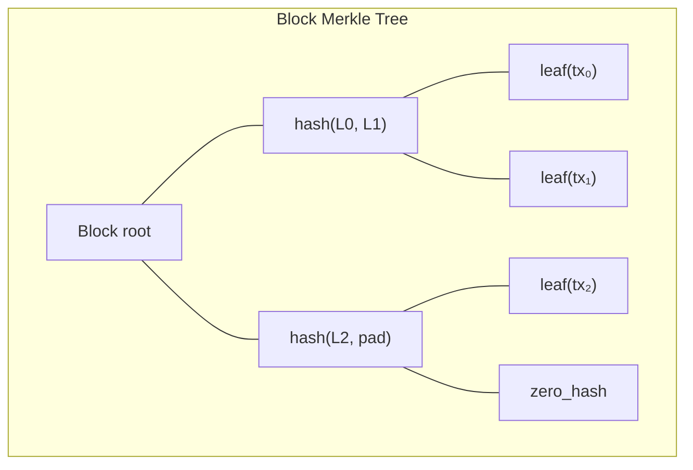

# Sequence Commitment

The sequence commitment chains blocks together, ensuring no transactions are skipped, reordered, or replayed between proof batches.

## Block chaining

Each proof batch processes a sequence of blocks. The guest maintains a running `seq_commitment` value that starts at `prev_seq_commitment` (from `PublicInput`) and is updated after each block:

```
seq_commitment' = merkle_hash(seq_commitment, block_root)
```



This is computed using:

```rust
{{#include ../../core/src/seq_commit.rs:calc_accepted_id_merkle_root}}
```

The on-chain script verifies the new `seq_commitment` by using `OpChainblockSeqCommit`, which returns the same value computed by the consensus layer. This anchors the proof to the actual Kaspa block DAG.

## Transaction leaf hashing

Within each block, every transaction contributes a leaf to the block's Merkle tree:

```rust
{{#include ../../core/src/seq_commit.rs:seq_commitment_leaf}}
```

The leaf hash includes both the `tx_id` and the transaction `version`. This matches Kaspa's consensus-level sequence commitment computation.

## Streaming Merkle builder

The block Merkle tree is built incrementally using a streaming algorithm that requires no heap allocation:

```rust
{{#include ../../core/src/streaming_merkle.rs:streaming_merkle_add_leaf}}
```

```rust
{{#include ../../core/src/streaming_merkle.rs:streaming_merkle_finalize}}
```



The streaming builder uses a fixed-size stack of `(level, hash)` pairs. When two entries at the same level are adjacent, they are merged into a parent. Incomplete subtrees are padded with zero hashes during finalization.

## Hash operations

The sequence commitment tree uses Blake3 with keyed hashing:

```rust
{{#include ../../core/src/seq_commit.rs:seq_hash_ops}}
```

| Operation | Domain separator | Hash function |
|-----------|-----------------|---------------|
| Branch hash | `SeqCommitmentMerkleBranchHash` | Blake3 (keyed) |
| Leaf hash | `SeqCommitmentMerkleLeafHash` | Blake3 (keyed) |
| Empty subtree | — | Zero hash `[0u32; 8]` |

The zero-padding for empty subtrees matches Kaspa's `calc_merkle_root` behavior with the `PREPEND_ZERO_HASH` flag.

## Kaspa compatibility

The implementation is tested against Kaspa's native `kaspa-merkle` crate to ensure identical output for all tree sizes. See `core/src/seq_commit.rs` tests for compatibility verification against `kaspa_merkle::calc_merkle_root_with_hasher`.

## Why this matters

Without sequence commitment verification, a malicious host could:

- **Skip blocks** — omit blocks containing unfavorable transactions
- **Reorder blocks** — change the order of state transitions
- **Replay blocks** — process the same transactions twice

The sequence commitment anchors the proof to the actual Kaspa DAG. The on-chain `OpChainblockSeqCommit` opcode recomputes the same value from consensus data, ensuring the guest processed exactly the right blocks.
