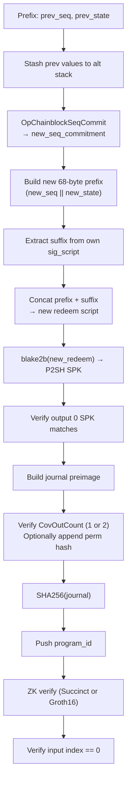
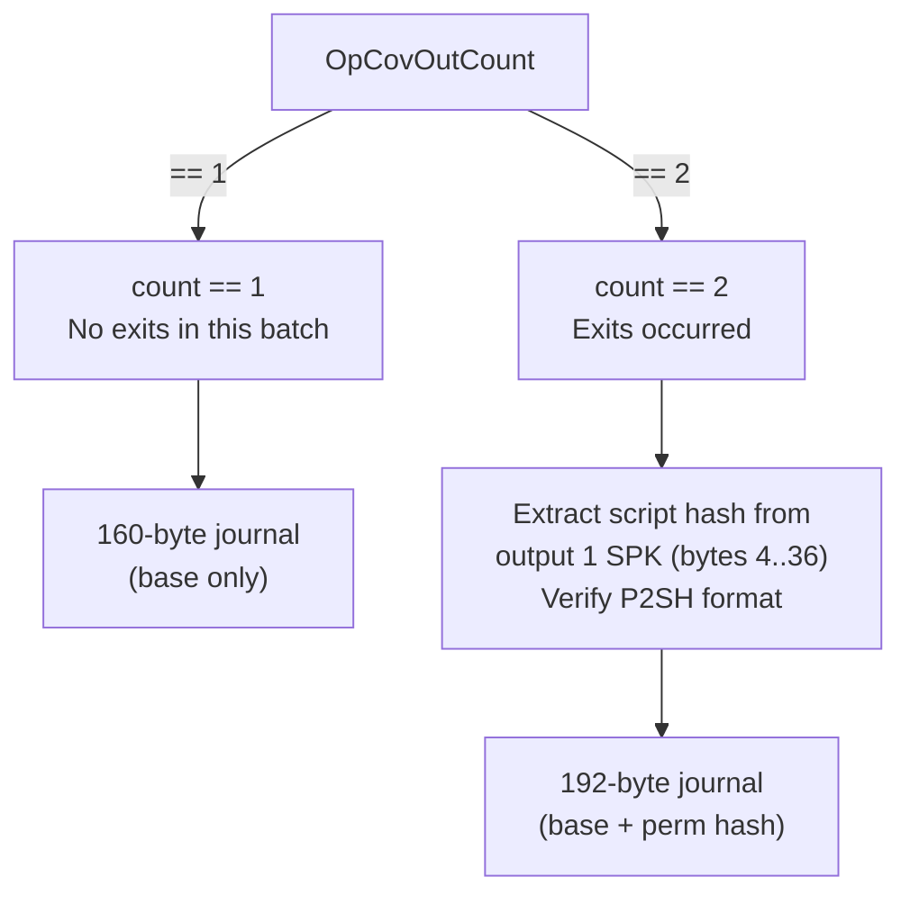

# State Verification Script

The state verification script is the on-chain redeem script that guards the covenant UTXO. It verifies ZK proofs, enforces state transitions, and ensures the covenant UTXO chain continues correctly.

## Script structure

The redeem script embeds the previous state directly in its bytecode:

```
[domain_prefix(2B)] [OpData32, prev_seq(32B)] [OpData32, prev_state(32B)]
[... verification logic ...]
[OpTrue]
```

The **68-byte prefix** contains:
- 2 bytes: domain tag `[OP_0(0x00), OP_DROP(0x75)]` — identifies this as a state verification script
- 1 + 32 bytes: `OpData32 || prev_seq_commitment`
- 1 + 32 bytes: `OpData32 || prev_state_hash`

See `host/src/covenant.rs:17` for the `REDEEM_PREFIX_LEN` constant.

## Self-referential length convergence

The script embeds its own length (as a parameter to `OpTxInputScriptSigSubstr`). Since changing the length changes the script, which changes the length, the build process iterates until convergence:

1. Start with an estimated length (e.g., 200)
2. Build the script with that length
3. If the actual length differs, rebuild with the new length
4. Repeat until stable (typically 2-3 iterations)

This same pattern is used by the permission script (see [Chapter 9](ch09-permission-script.md)).

## Script data flow



## Key operations

### Sequence commitment verification

The script uses `OpChainblockSeqCommit` — a Kaspa-specific opcode that computes the sequence commitment from consensus data. The guest's `new_seq_commitment` must match what the chain reports.

See `host/src/covenant.rs:77-83` for the `obtain_new_seq_commitment` implementation.

### Output SPK verification

After building the new redeem script, the script hashes it to a P2SH SPK and verifies that output 0 pays to that address. This ensures the covenant UTXO chain continues with the updated state.

### Journal construction

The script builds the journal preimage from:
1. `prev_state` and `prev_seq` (from alt stack, originally embedded in prefix)
2. `new_state` and `new_seq` (computed during execution)
3. `covenant_id` (via `OpInputCovenantId` introspection)
4. Optionally: `permission_spk_hash` (if 2 covenant outputs exist)

See `host/src/covenant.rs:132-161` for the `build_and_hash_journal` implementation.

### Output branching (1 vs 2 covenant outputs)



When exits occur, the guest includes a `permission_spk_hash` in the journal. The on-chain script:
1. Reads `OpCovOutCount` — if 2, a permission output exists
2. Extracts the script hash from output 1's P2SH SPK (bytes 4..36 of `to_bytes()`)
3. Verifies output 1 is actually P2SH format (reconstructs and compares)
4. Appends the 32-byte script hash to the journal preimage

See `host/src/covenant.rs:163-206` for `verify_outputs_and_append_perm_hash`.

### ZK proof verification

The final SHA-256 hash of the journal, plus the `program_id`, are consumed by the ZK verification opcode (`OpRisc0Succinct` or `OpRisc0Groth16`). This verifies that a valid RISC Zero proof exists in the transaction witness data whose journal matches the on-chain computed value.

## Domain tagging

The script starts with `[OP_0, OP_DROP]` — a 2-byte no-op that serves as a domain tag. The last 2 bytes of the sig_script (which equal the last 2 bytes of the redeem script) are `[0x00, 0x75]`. Other scripts in the covenant system check these bytes via `OpTxInputScriptSigSubstr` to distinguish script types:

| Domain | Suffix bytes | Script |
|--------|-------------|--------|
| State verification | `[0x00, 0x75]` | This script |
| Permission | `[0x51, 0x75]` | [Chapter 9](ch09-permission-script.md) |

The delegate script ([Chapter 10](ch10-delegate-script.md)) checks that input 0's suffix is `[0x51, 0x75]` to verify it co-spends with a permission input.
