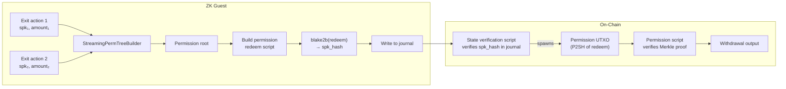

# Permission Tree

The permission tree is a SHA-256 Merkle tree that accumulates withdrawal claims from exit actions. It bridges the ZK proof (which commits the tree root) to the on-chain permission script (which verifies individual claims).

## Lifecycle



## Leaf hashing

Each exit action produces one leaf:

```rust
{{#include ../../core/src/permission_tree.rs:perm_leaf_hash}}
```

The SPK is variable-length (34 or 35 bytes depending on address type). The amount is encoded as 8-byte little-endian.

## Tree depth

The tree depth is variable based on the number of exits:

```rust
{{#include ../../core/src/permission_tree.rs:required_depth}}
```

| Exits | Depth | Capacity |
|-------|-------|----------|
| 0 | 1 | 2 |
| 1-2 | 1 | 2 |
| 3-4 | 2 | 4 |
| 5-8 | 3 | 8 |
| 9-16 | 4 | 16 |
| ... | ... | ... |
| 129-256 | 8 | 256 |

Maximum depth is 8 (256 leaves), matching the account SMT capacity.

## Padding to depth

The streaming builder produces a root whose effective depth is `ceil(log2(leaf_count))`. If the target depth is larger, empty subtrees are appended on the right:

```rust
{{#include ../../core/src/permission_tree.rs:pad_to_depth}}
```

## Streaming builder

The permission tree uses the same `StreamingMerkle<H>` generic builder as the sequence commitment tree, but parameterized with SHA-256 permission-tree hash operations:

```rust
{{#include ../../core/src/permission_tree.rs:perm_proof}}
```

## Guest builds the permission script

After all blocks are processed, if any exits occurred:

1. The host provides the expected redeem script length (private input)
2. Guest computes `required_depth(perm_count)`
3. Guest finalizes the streaming builder and pads to depth
4. Guest builds the entire permission redeem script in `no_std` (see `core/src/permission_script.rs`)
5. Guest asserts the script length matches the host-provided value
6. Guest computes `blake2b(redeem_script)` → `script_hash`
7. Guest writes the script hash to the journal

The host-provided length is needed because the script embeds its own length (self-referential). The guest builds the script once and asserts — it does **not** iterate. The host must have converged the length beforehand.

## On-chain usage

The state verification script checks if `CovOutCount == 2`. If so, it verifies that the second covenant output's P2SH script hash matches the journal's `permission_spk_hash`. This spawns a permission UTXO that can be spent by the permission script (see [Chapter 9](ch09-permission-script.md)).

The permission script embeds the root and unclaimed count. Each withdrawal claim walks the Merkle tree twice (old root verification + new root computation) and updates the embedded state.
