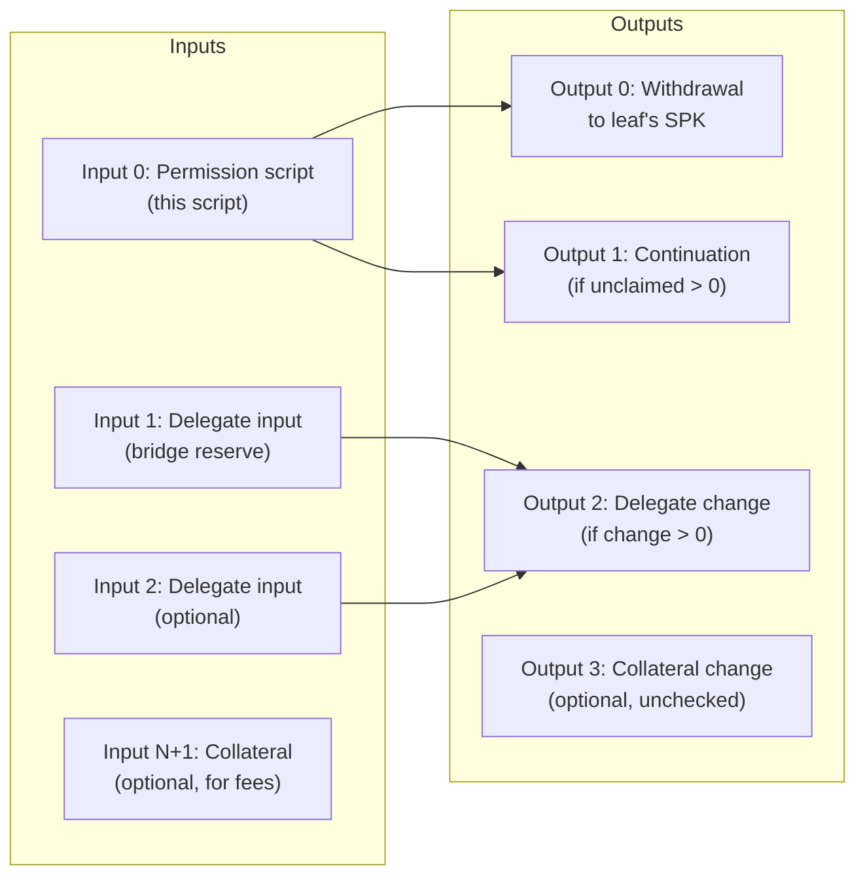
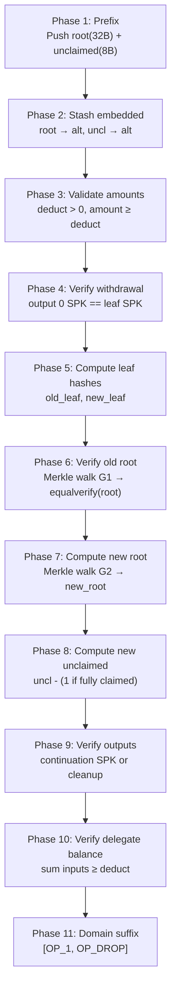

# Permission Script — 11 Phases

The permission script governs L2→L1 withdrawals. It verifies a Merkle proof against the embedded root, pays the withdrawal to the correct address, and optionally continues the permission UTXO with updated state.

## Transaction layout



## Sig_script push order

The sig_script pushes values in this order (bottom of stack first):

```
G2_sib_{d-1}, G2_dir_{d-1}, ..., G2_sib_0, G2_dir_0,
G1_sib_{d-1}, G1_dir_{d-1}, ..., G1_sib_0, G1_dir_0,
spk(var), amount(8B LE), deduct(i64),
redeem_script
```

G1 and G2 are the same Merkle path (siblings and direction bits), used twice: once to verify the old root and once to compute the new root.

## Phase sequence



## Phase details

### Phase 1: Prefix (42 bytes)

The prefix embeds the permission root and unclaimed count directly in the script bytecode:

```
OpData32(1B) || root(32B) || OP_DATA_8(1B) || unclaimed_count(8B)
```

After execution, the stack has `[root(32B), unclaimed_count(8B)]` on top.

### Phase 2: Stash embedded

Moves root and unclaimed_count to the alt stack for later comparison/update.

```
Main:  [...G2, ...G1, spk, amount, deduct]
Alt:   [uncl_emb, root_emb]
```

### Phase 3: Validate amounts

Verifies `deduct > 0` and computes `new_amount = amount - deduct >= 0`. Stashes `deduct` to alt for Phase 10 (delegate balance).

### Phase 4: Verify withdrawal

Prepends a 2-byte version prefix to `spk` and compares with `OpTxOutputSpk(0)`. This ensures the withdrawal output pays to the leaf's designated address.

### Phase 5: Compute leaf hashes

Computes both the old leaf hash (`SHA256("PermLeaf" || spk || amount)`) and the new leaf hash. If `new_amount == 0`, the new leaf is the empty leaf hash (`SHA256("PermEmpty")`), indicating the claim is fully consumed.

### Phase 6: Verify old root

Walks the G1 Merkle path (depth steps), each consuming a `(sibling, direction)` pair. The computed root is compared against the embedded root via `OpEqualVerify`.

Each Merkle step:
```
SWAP → IF → [sib||current] → ELSE → SWAP → [current||sib] → ENDIF
→ CAT → push("PermBranch") → SWAP → CAT → SHA256
```

### Phase 7: Compute new root

Identical Merkle walk using G2 siblings, but starting from the new leaf hash. The result is the updated permission root.

### Phase 8: Compute new unclaimed

If the leaf was fully consumed (`new_amount == 0`), decrements `unclaimed_count` by 1. Converts to 8-byte LE for prefix reconstruction.

### Phase 9: Verify outputs

Two branches based on `new_unclaimed`:

**All claimed (new_uncl == 0):** Drop the new root and unclaimed. Verify `CovOutCount == 0` — no continuation output should exist.

**Unclaimed remain (new_uncl > 0):**
1. Reconstruct the 42-byte new prefix from `new_root` and `new_uncl`
2. Extract the script body+suffix from the current sig_script (self-introspection)
3. Concatenate → new redeem script
4. Hash to P2SH SPK and verify output 1 matches
5. Verify `CovOutCount == 1` and `CovOutputIdx(0) == 1` (the single covenant output is at output index 1)

### Phase 10: Verify delegate balance

Enforces the delegate input/output balance equation:

1. `input_count <= MAX_DELEGATE_INPUTS + 2`
2. Reconstructs the expected delegate P2SH SPK from `covenant_id`
3. Sums amounts from inputs 1..N whose SPK matches the delegate SPK
4. Guards that input N+1 does NOT have the delegate SPK (prevents overcounting)
5. Computes `expected_change = total_input - deduct >= 0`
6. If `expected_change > 0`: verifies `output[1 + CovOutCount]` has delegate SPK and correct amount

### Phase 11: Domain suffix

Appends `[OP_TRUE(0x51), OP_DROP(0x75)]` after the final `OP_TRUE`. This is a no-op that tags the script for cross-script introspection by the delegate script.

## Implementation

The permission script has two implementations that produce identical bytecode:

1. **Host** (`host/src/bridge.rs`) — uses `ScriptBuilder` from `kaspa-txscript`
2. **Core** (`core/src/permission_script.rs`) — `no_std` byte-level builder

The guest uses the core implementation to build the script inside the ZK proof, then hashes it to produce the `permission_spk_hash` for the journal.

See `core/src/permission_script.rs:139-209` for `build_permission_redeem_bytes` and the converging length loop.
