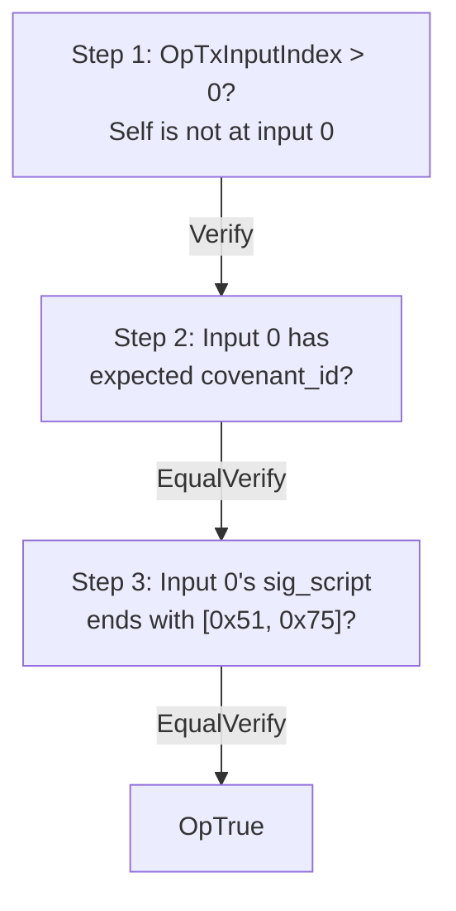

# Delegate/Entry Script

The delegate script is a 53-byte P2SH redeem script that allows funds to ride alongside a permission input. It serves dual duty: it locks deposit outputs for entries and provides bridge reserve inputs for withdrawals.

## Purpose

When a user deposits funds (entry action), the funds must be locked in a way that:
1. Only the covenant system can spend them
2. The guest can verify the deposit is genuine

When a withdrawal is processed, the permission script needs additional inputs to fund the withdrawal. Delegate inputs provide this liquidity.

## Script structure



The script is 53 bytes:

| Offset | Size | Content |
|--------|------|---------|
| 0-3 | 4B | Index check: `OpTxInputIndex Op0 OpGreaterThan OpVerify` |
| 4-6 | 3B | Covenant preamble: `Op0 OpInputCovenantId OpData32` |
| 7-38 | 32B | Embedded `covenant_id` |
| 39 | 1B | `OpEqualVerify` |
| 40-51 | 12B | Suffix check: extract last 2 bytes of input 0's sig_script, compare with `[0x51, 0x75]` |
| 52 | 1B | `OpTrue` |

See `core/src/p2sh.rs:103-156` for `build_delegate_entry_script_bytes`.

## Three verification steps

### Step 1: Not at input 0

```
OpTxInputIndex  Op0  OpGreaterThan  OpVerify
```

The delegate script must not be at input index 0. Index 0 is reserved for the permission script (or state verification script). This prevents the delegate from being used as the primary covenant input.

### Step 2: Covenant ID match

```
Op0  OpInputCovenantId  OpData32  <covenant_id>  OpEqualVerify
```

Checks that input 0 carries the expected `covenant_id`. This binds the delegate to a specific covenant instance — it cannot be co-spent with a different covenant's permission script.

### Step 3: Permission domain suffix

```
Op0 Op0 OpTxInputScriptSigLen OpDup Op2 OpSub OpSwap OpTxInputScriptSigSubstr
push-2 0x51 0x75 OpEqualVerify
```

Extracts the last 2 bytes of input 0's sig_script and verifies they are `[0x51, 0x75]` (the permission domain suffix). This ensures the delegate is co-spending with a **permission** input specifically, not a state verification input.

## Deposit SPK verification

When a user creates an entry (deposit) transaction, the output must pay to `P2SH(delegate_script(covenant_id))`. The guest verifies this:

```rust
{{#include ../../core/src/p2sh.rs:verify_entry_output_spk}}
```

This reconstructs the expected delegate script from the `covenant_id`, hashes it with blake2b, and compares with the output's P2SH script hash.

## Entry input guard

The guest also checks that entry transactions do NOT have a permission script as input 0:

```rust
{{#include ../../core/src/prev_tx.rs:input0_has_permission_suffix}}
```

This prevents a subtle attack: without this guard, the delegate change output from a withdrawal transaction could be misinterpreted as a new deposit. The permission suffix check distinguishes withdrawal change from genuine deposits.

## Design rationale

**Why a separate script?** The delegate script allows bridge reserve funds to be pre-positioned in UTXOs that can only be spent alongside a permission input. This avoids requiring the entire bridge reserve in a single UTXO.

**Why check the suffix?** The covenant_id check alone is insufficient — it would allow co-spending with a state verification input (which has suffix `[0x00, 0x75]`). The suffix check ensures delegates only participate in withdrawal transactions.

**Why `MAX_DELEGATE_INPUTS = 2`?** The permission script unrolls the delegate input loop. More inputs mean a larger script. Two delegate inputs are sufficient for the PoC while keeping the script compact.
