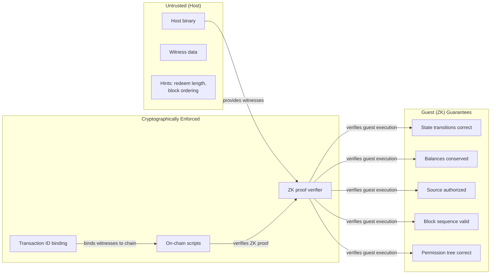

# Security Model

This chapter catalogues every check in the system, the attack it prevents, and where trust boundaries lie.

## Trust boundaries

## What the host can lie about

The host provides private inputs (witnesses) to the guest. Some are trusted hints, others are cryptographically bound.

| Host input | Bound by | Attack if omitted |
|------------|----------|-------------------|
| Block transaction data | `OpChainblockSeqCommit` on-chain | Host could fabricate transactions |
| Previous tx preimage | tx_id hash verification | Host could claim false output SPKs |
| Account SMT witnesses | Root hash chain | Host could fabricate balances |
| Permission redeem length | Assert in guest | Guest script wouldn't match on-chain hash |
| Action ordering within block | Seq commitment leaf hash | Host could reorder or skip actions |

## Check catalogue

### Guest-side checks

| Check | Location | Attack prevented |
|-------|----------|-----------------|
| `is_action_tx_id(tx_id)` | `guest/src/block.rs` | Non-action transactions processed as actions |
| `tx_id[0] == 0x41` | `core/src/lib.rs` | Random transactions misclassified |
| Action version == `ACTION_VERSION` | `guest/src/tx.rs` | Future/incompatible action formats |
| `deduct > 0` | `guest/src/state.rs` | Zero-value withdrawal claims |
| `amount >= deduct` | `guest/src/state.rs` | Underflow in withdrawal amount |
| Source pubkey matches input 0 SPK | `guest/src/auth.rs` | Unauthorized transfers/exits |
| SMT proof verifies against root | `guest/src/state.rs` | Fabricated account balances |
| Balance conservation (transfer) | `guest/src/state.rs` | Value creation from nothing |
| Entry output SPK is P2SH(delegate) | `core/src/p2sh.rs` | Deposits to unrelated addresses credited as L2 entries |
| Entry tx input 0 not permission suffix | `core/src/prev_tx.rs` | Delegate change output misinterpreted as deposit |
| Prev tx_id matches computed hash | `core/src/prev_tx.rs` | Host claims false output SPK/amounts |
| Exit SPK length <= `EXIT_SPK_MAX` | `core/src/action.rs` | Oversized SPK overflows |
| Seq commitment matches chain | On-chain `OpChainblockSeqCommit` | Fabricated block data |
| Permission root matches exits | `guest/src/journal.rs` | Incorrect withdrawal tree committed |
| Redeem script length matches host hint | `guest/src/journal.rs` | Script hash mismatch |

### On-chain checks (state verification script)

| Check | Phase | Attack prevented |
|-------|-------|-----------------|
| Domain prefix `[0x00, 0x75]` | Start | Script type confusion |
| Prev state embedded in script | Prefix | State rollback or skip |
| `OpChainblockSeqCommit` | Seq commit | Fabricated block sequence |
| Output 0 SPK == P2SH(new redeem) | SPK verify | Covenant chain broken |
| Journal SHA-256 matches ZK proof | ZK verify | Proof for different state transition |
| Program ID matches | ZK verify | Proof from different program |
| Input index == 0 | Guard | Script used at wrong position |
| `CovOutCount` == 1 or 2 | Output branch | Unexpected covenant outputs |
| Output 1 P2SH format (if 2 outputs) | Perm verify | Non-P2SH permission output |

### On-chain checks (permission script)

| Check | Phase | Attack prevented |
|-------|-------|-----------------|
| `deduct > 0` | Phase 3 | Zero-value claims drain UTXO |
| `amount >= deduct` | Phase 3 | Balance underflow |
| Output 0 SPK == leaf SPK | Phase 4 | Withdrawal to wrong address |
| Old leaf hash verifies under root | Phase 6 | Fabricated Merkle proof |
| New root correctly computed | Phase 7 | State corruption after claim |
| Unclaimed decremented correctly | Phase 8 | Count desync |
| Continuation SPK matches | Phase 9 | Permission UTXO chain broken |
| `CovOutCount` correct | Phase 9 | Unexpected covenant outputs |
| `output_count <= 4` | Phase 9 | Transaction stuffing |
| `input_count <= N+2` | Phase 10 | Overcounting delegate inputs |
| Delegate SPK matches covenant | Phase 10 | Spending unrelated UTXOs as delegates |
| Input N+1 not delegate SPK | Phase 10 | Collateral miscounted as delegate |
| `total_input >= deduct` | Phase 10 | Insufficient delegate funds |
| Delegate change output correct | Phase 10 | Change amount/address incorrect |

### On-chain checks (delegate/entry script)

| Check | Step | Attack prevented |
|-------|------|-----------------|
| Self not at input index 0 | Step 1 | Delegate used as primary covenant input |
| Input 0 covenant_id matches | Step 2 | Co-spent with wrong covenant |
| Input 0 suffix `[0x51, 0x75]` | Step 3 | Co-spent with state verification (not permission) |

## Attack scenarios and mitigations

### Malicious host credits fake deposits

**Attack:** Host provides a witness claiming a deposit output SPK that doesn't actually pay to `P2SH(delegate_script(covenant_id))`.

**Mitigation:** Guest calls `verify_entry_output_spk()` which reconstructs the expected delegate script from the covenant_id, hashes it, and compares with the output's P2SH hash. The tx_id binding ensures the output actually exists on-chain.

### Delegate change output mistaken for deposit

**Attack:** A withdrawal transaction creates a delegate change output paying to the delegate script. A malicious host presents this as a new deposit in the next batch.

**Mitigation:** Guest calls `input0_has_permission_suffix()` on the entry transaction's preimage. If input 0 ends with `[0x51, 0x75]` (permission domain), the transaction is a withdrawal — the output is delegate change, not a deposit.

### Cross-covenant co-spending

**Attack:** A delegate input from covenant A is co-spent with a permission input from covenant B, draining A's bridge reserve.

**Mitigation:** The delegate script embeds a specific `covenant_id` and verifies input 0 carries that same ID. Different covenants have different IDs, so cross-covenant co-spending fails.

### Proof replay

**Attack:** A valid ZK proof from a previous state transition is replayed to revert state.

**Mitigation:** The journal includes `prev_state_hash` and `prev_seq_commitment`, both embedded in the redeem script prefix. The on-chain script verifies these match. Since the seq_commitment changes with every block, a replayed proof would fail the sequence check.

### Collateral input overcounting

**Attack:** An attacker provides extra inputs beyond the delegate slots and hopes they're counted toward the delegate balance.

**Mitigation:** Phase 10 enforces `input_count <= MAX_DELEGATE_INPUTS + 2` and explicitly guards that input N+1 does NOT have the delegate SPK. The unrolled loop only sums inputs at indices 1..N.

## Conservation properties

The system maintains two conservation invariants:

1. **L2 balance conservation:** Every transfer preserves total L2 balance (amount sent equals amount received). Entries increase total L2 balance by the deposit amount. Exits decrease it by the withdrawal amount.

2. **Bridge reserve conservation:** The permission script enforces `delegate_input_total >= deduct` and verifies the change output amount equals `total - deduct`. No value is created or destroyed during withdrawals.
