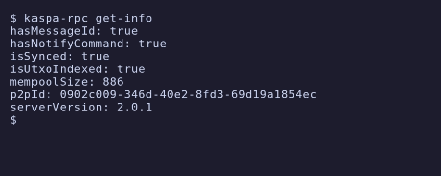
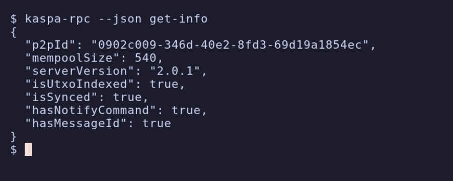

# kaspa-rpc

A non-interactive command-line client for the Kaspa node RPC API. `kaspa-rpc`
turns every covered RPC method into a subcommand, prints results to stdout as
human-readable text or machine-readable JSON, and exits with a meaningful status
code. It is built for scripting, automation, monitoring, and agent workflows
where an interactive shell is not available.

The crate ships both ways:

- a `kaspa-rpc` binary for the shell, and
- a `kaspa_rpc_cli` library (`Cli` / `connect` / `run`) you can embed in your own
  Rust programs.

Both transports are supported transparently: gRPC (`grpc://`) and wRPC over
WebSocket (`ws://` / `wss://`), with borsh or JSON encoding for wRPC.

## Demo


## Install / build

Build the binary from the workspace root:

```bash
cargo build -p kaspa-rpc-cli --bin kaspa-rpc
```

The binary is produced at `target/debug/kaspa-rpc` (or `target/release/kaspa-rpc`
with `--release`). Install it onto your `PATH` with:

```bash
cargo install --path rpc/cli
```

All examples below assume `kaspa-rpc` is on your `PATH`. Replace `<NODE>` (or
`HOST`) with your node's host. A node URL is always required; see
[Connection and transport](#connection-and-transport).

## Quick start

Query a node's general info over each transport. The transport is inferred from
the URL scheme.

wRPC (WebSocket, borsh):

```bash
kaspa-rpc --url ws://<NODE>:17210 get-info
```

gRPC:

```bash
kaspa-rpc --url grpc://<NODE>:16210 get-info
```

A node URL is mandatory. With the network selected, the port can be left off and
the matching default is filled in:

```bash
kaspa-rpc --network mainnet --url ws://<NODE> get-info     # fills wRPC borsh port 17110
```

List every available command:

```bash
kaspa-rpc --help
```

## Output modes: text vs JSON

Output is human-readable text by default. Pass `--json` (a shorthand for
`--output json`) for pretty-printed JSON suitable for piping into `jq` or other
tools. Result data goes to stdout; logs and errors go to stderr, so redirection
stays clean.

| Default text | `--json` |
| --- | --- |
|  |  |

The same command in both modes:

```bash
$ kaspa-rpc get-info
hasMessageId: true
hasNotifyCommand: true
isSynced: true
isUtxoIndexed: true
mempoolSize: 503
p2pId: 0902c009-346d-40e2-8fd3-69d19a1854ec
serverVersion: 2.0.1

$ kaspa-rpc --json get-info
{
  "p2pId": "0902c009-346d-40e2-8fd3-69d19a1854ec",
  "mempoolSize": 503,
  "serverVersion": "2.0.1",
  "isUtxoIndexed": true,
  "isSynced": true,
  "hasNotifyCommand": true,
  "hasMessageId": true
}
```

## Connection and transport

### A node URL is required

`kaspa-rpc` never guesses a host. You must supply a node URL through `--url` or
through `url` in the config file. With neither set, the command fails with a
usage error (exit code 64):

```text
kaspa-rpc: usage: no node URL specified: pass --url <URL> (for example `grpc://HOST:16110`, `ws://HOST:17110`, or `wss://HOST`) or set `url` in the config file
```

Fix it by passing a URL or setting one in config:

```bash
kaspa-rpc --url ws://HOST get-info          # pass it on the command line
kaspa-rpc config set url ws://HOST          # or store it in the config file
```

### Scheme inference

The transport is chosen from the URL scheme. A bare host with no scheme uses
`--transport` (default wRPC) and is given the `ws` scheme.

| URL form | Transport |
| --- | --- |
| `grpc://HOST[:PORT]` | gRPC |
| `ws://HOST[:PORT]` | wRPC (WebSocket) |
| `wss://HOST[:PORT]` | wRPC (WebSocket, TLS) |
| `HOST[:PORT]` (no scheme) | from `--transport` (default wRPC, `ws` scheme) |

### URL forms

The port may be given explicitly, or omitted to fill in the default for the
resolved `(network, transport, encoding)` triple. `--network` selects which
default-port set applies (it defaults to `mainnet`). `--encoding borsh|json`
applies to wRPC only and defaults to `borsh`.

| Command | Transport / encoding | Port |
| --- | --- | --- |
| `--url grpc://HOST:16110` | gRPC | explicit |
| `--url grpc://HOST --network mainnet` | gRPC | defaulted (16110) |
| `--url HOST --transport grpc` | gRPC (bare host + flag) | defaulted |
| `--url ws://HOST:17110` | wRPC borsh (default) | explicit |
| `--url ws://HOST` | wRPC borsh | defaulted (borsh) |
| `--url HOST` | wRPC borsh (bare host, defaults) | defaulted |
| `--url ws://HOST:18110 --encoding json` | wRPC JSON | explicit |
| `--url ws://HOST --encoding json` | wRPC JSON | defaulted (json) |
| `--url wss://HOST:17110` | wRPC borsh over TLS | explicit |
| `--url wss://HOST` | wRPC borsh over TLS | defaulted |

### Default ports

When the URL omits a port, the default is taken from the network and the
resolved transport/encoding. Networks accepted by `--network` are `mainnet`,
`testnet-10`, `testnet-11`, `devnet`, and `simnet` (both testnet variants share
the testnet ports).

| Network | gRPC | wRPC borsh | wRPC JSON |
| --- | --- | --- | --- |
| mainnet | 16110 | 17110 | 18110 |
| testnet | 16210 | 17210 | 18210 |
| simnet | 16510 | 17510 | 18510 |
| devnet | 16610 | 17610 | 18610 |

```bash
kaspa-rpc --network testnet-10 --url ws://<NODE> get-block-dag-info   # fills 17210
```

### Explicit overrides

- `--transport grpc|wrpc` forces a transport regardless of the URL scheme (and
  supplies the scheme for a bare host).
- `--encoding borsh|json` selects the wRPC encoding (wRPC only; default `borsh`).
  It also picks which default wRPC port is used.
- `--timeout <SECONDS>` sets the request/connect timeout (default 30s).

These same values can come from the config file or the environment
(`KASPA_RPC_URL`, `KASPA_RPC_NETWORK`, `KASPA_RPC_TRANSPORT`,
`KASPA_RPC_ENCODING`); see [Configuration](#configuration-file-environment-precedence).
Precedence is flags > environment > config file.

```bash
kaspa-rpc --url grpc://<NODE>:16210 --json get-info
kaspa-rpc --transport wrpc --encoding json --url ws://<NODE>:18210 get-info
```

## Subscriptions

`kaspa-rpc subscribe <scope>` registers a listener, starts a single notification
scope, and streams one line per notification to stdout until you press Ctrl-C,
which performs a clean shutdown. In text mode each line is a concise summary; in
`--json` mode each line is one compact JSON object, which is convenient for
streaming into line-oriented tooling.

```bash
kaspa-rpc subscribe block-added
kaspa-rpc subscribe virtual-daa-score-changed
kaspa-rpc --json subscribe utxos-changed --address kaspatest:qz...
```

Available scopes: `block-added`, `virtual-chain-changed`, `utxos-changed`,
`sink-blue-score-changed`, `virtual-daa-score-changed`, `finality-conflict`,
`finality-conflict-resolved`, `pruning-point-utxo-set-override`, and
`new-block-template`.

Each invocation streams exactly one scope. To watch several scopes at once, run
multiple instances in parallel:

```bash
kaspa-rpc subscribe block-added &
kaspa-rpc subscribe virtual-daa-score-changed &
```

For `utxos-changed`, pass `--address` once per address to filter; with no
address it subscribes to all UTXO changes. For `virtual-chain-changed`, pass
`--include-accepted-transaction-ids` to include accepted transaction ids.

## The generic `call` escape hatch

`kaspa-rpc call <method> [params]` invokes any covered RPC method by name without
a dedicated subcommand. The method name accepts kebab- or snake-case. Parameters
are supplied as inline JSON, or read from a file with `@file`, or from stdin with
`@-`. Omit the parameters for methods that take none.

```bash
kaspa-rpc call get-block-dag-info
kaspa-rpc call get-balance-by-address '{"address":"kaspatest:qz..."}'
kaspa-rpc call get-block @request.json
echo '{"hash":"<HASH>","includeTransactions":true}' | kaspa-rpc call get-block @-
```

## Configuration: file, environment, precedence

Settings can come from a config file, environment variables, or command-line
flags. Precedence is, highest to lowest:

1. command-line flags,
2. `KASPA_RPC_*` environment variables,
3. the config file.

### Config file

The default config file is `~/.config/kaspa-rpc/config.toml`. Override the path
with `--config <PATH>`, or ignore config files entirely with `--no-config`.

```toml
# ~/.config/kaspa-rpc/config.toml
url = "ws://<NODE>:17210"
network = "testnet-10"
transport = "wrpc"
encoding = "borsh"
output = "text"
timeout = 30
```

Inspect the resolved configuration:

```bash
kaspa-rpc config path     # print the config file path that would be used
kaspa-rpc config show     # print the merged file + environment configuration
```

Edit the config file in place (it is created, with parent directories, if it
does not yet exist). Values are validated against the key's type, so a bad value
fails with a usage error instead of writing a broken file:

```bash
kaspa-rpc config set url ws://<NODE>:17210   # write a key
kaspa-rpc config set network testnet-10
kaspa-rpc config unset url                    # remove a key
```

Settable keys are `url`, `network`, `transport`, `encoding`, `output`, and
`timeout` (the same fields shown in the config file above). Edits touch only the
config file; environment variables and flags continue to override it at run time.

### Environment variables

| Variable | Equivalent flag |
| --- | --- |
| `KASPA_RPC_URL` | `--url` |
| `KASPA_RPC_NETWORK` | `--network` |
| `KASPA_RPC_TRANSPORT` | `--transport` |
| `KASPA_RPC_ENCODING` | `--encoding` |
| `KASPA_RPC_OUTPUT` | `--output` |
| `KASPA_RPC_TIMEOUT` | `--timeout` |

```bash
KASPA_RPC_URL=ws://<NODE>:17210 kaspa-rpc get-info
```

## Shell completion

Generate a completion script to stdout for `bash`, `zsh`, `fish`, `powershell`,
or `elvish`, then install it for your shell.

bash:

```bash
kaspa-rpc completion bash > ~/.local/share/bash-completion/completions/kaspa-rpc
```

zsh (ensure the directory is on your `fpath`):

```bash
kaspa-rpc completion zsh > ~/.zfunc/_kaspa-rpc
# in ~/.zshrc:
#   fpath+=~/.zfunc
#   autoload -U compinit && compinit
```

fish:

```bash
kaspa-rpc completion fish > ~/.config/fish/completions/kaspa-rpc.fish
```

powershell (add to your `$PROFILE`):

```powershell
kaspa-rpc completion powershell | Out-String | Invoke-Expression
```

## Exit codes

The binary maps failures to `sysexits.h`-style exit codes so scripts can react
to the failure category.

| Code | Name | Meaning |
| --- | --- | --- |
| 0 | success | the command completed |
| 64 | `EX_USAGE` | bad invocation, arguments, or configuration |
| 69 | `EX_UNAVAILABLE` | connection failure or an RPC error from the node |
| 70 | `EX_SOFTWARE` | internal I/O or serialization failure |

Note that some methods may be unimplemented on a given node (for example
`get-headers` on certain builds); the node returns an RPC error and the CLI
surfaces it with exit code 69.

## Library usage

The engine is reusable from Rust. Parse arguments into a `Cli` and hand it to
`run`, which resolves configuration, connects, dispatches the command, renders
output, and returns a process exit code:

```rust
use clap::Parser;
use kaspa_rpc_cli::{run, Cli};
use std::process::ExitCode;

#[tokio::main]
async fn main() -> ExitCode {
    let cli = Cli::parse();
    run(cli).await.unwrap_or_else(|err| {
        eprintln!("kaspa-rpc: {err}");
        ExitCode::from(err.exit_code())
    })
}
```

For finer control, connect directly and use the resulting transport-agnostic
`Arc<dyn RpcApi>` handle:

```rust
use kaspa_consensus_core::network::{NetworkId, NetworkType};
use kaspa_rpc_cli::{connect, ConnectOptions};
use kaspa_rpc_core::api::rpc::RpcApi;
use kaspa_wrpc_client::WrpcEncoding;

#[tokio::main]
async fn main() -> Result<(), Box<dyn std::error::Error>> {
    let opts = ConnectOptions {
        url: Some("ws://127.0.0.1:17110".to_string()),
        network: NetworkId::new(NetworkType::Mainnet),
        transport: None, // inferred from the URL scheme
        encoding: WrpcEncoding::Borsh,
        timeout_ms: 30_000,
    };

    let client = connect(&opts).await?;
    let info = client.get_info().await?;
    println!("server version: {}", info.server_version);
    Ok(())
}
```

## License

See the workspace `LICENSE`.
